<!-- HERO MODULE -->

  

<code>
<b>[ PRIME_DIRECTIVE ]</b> 
"We are committed to making participation in this project 
a harassment-free experience for everyone."
</code>

  

<!-- STANDARDS GRID -->
<table width="100%" style="border: 0; border-collapse: collapse;">
    <tr>
        <td align="center" width="50%" style="border: 0; padding-bottom: 20px; vertical-align: top;">
            <code><b>[ POSITIVE_BEHAVIOR ]</b></code>  
              
            Using welcoming and inclusive language. 
            Respecting differing viewpoints. 
            Gracefully accepting constructive criticism. 
            Focusing on what is best for the community.
        </td>
        <td align="center" width="50%" style="border: 0; padding-bottom: 20px; vertical-align: top;">
            <code><b>[ UNACCEPTABLE_BEHAVIOR ]</b></code>  
              
            Trolling, insulting/derogatory comments. 
            Public or private harassment. 
            Publishing others' private information. 
            Conduct which could reasonably be considered inappropriate.
        </td>
    </tr>
</table>

  

<!-- ENFORCEMENT FLOW -->

 

<code>

```mermaid
%%{init: {'theme': 'base', 'themeVariables': { 'primaryColor': '#0d1117', 'primaryTextColor': '#39ff14', 'primaryBorderColor': '#ff00ff', 'lineColor': '#39ff14', 'secondaryColor': '#0d1117', 'tertiaryColor': '#0d1117'}}}%%
graph TD
    A[REPORT_FILED] -->|Review| B{INVESTIGATION}
    B -->|Violation?| C[YES]
    B -->|No| D[DISMISS]
    C -->|Minor| E[WARNING]
    C -->|Major| F[BAN_USER]
    style A fill:#0d1117,stroke:#39ff14,stroke-width:2px
    style B fill:#0d1117,stroke:#ff00ff,stroke-width:2px
    style C fill:#0d1117,stroke:#ff0055,stroke-width:2px
    style E fill:#0d1117,stroke:#ff00ff,stroke-width:2px
    style F fill:#0d1117,stroke:#ff0055,stroke-width:2px
```

[ ENFORCEMENT_CONTACT: [YOUR_EMAIL_HERE] ] • [ SYSTEM_PROTECTED ]
</code>

<!-- TEMPLATE_NOTE: Replace [YOUR_EMAIL_HERE] with your actual contact email -->

