<!-- HERO MODULE -->

  

<code>
<b>[ SYSTEM_NOTICE ]</b> 
"Collaboration is the engine of innovation. 
Review the following protocols before initiating data transfer."

```mermaid
%%{init: {'theme': 'base', 'themeVariables': { 'primaryColor': '#0d1117', 'primaryTextColor': '#39ff14', 'primaryBorderColor': '#ff00ff', 'lineColor': '#39ff14', 'secondaryColor': '#0d1117', 'tertiaryColor': '#0d1117'}}}%%
graph LR
    START((START)) -->|Fork| A[REPOSITORY]
    A -->|Branch| B{DEVELOP}
    B -->|Commit| C[PUSH_CODE]
    C -->|PR| D[CODE_REVIEW]
    D -->|Merge| END((MAIN))
    style START fill:#0d1117,stroke:#39ff14,stroke-width:2px
    style A fill:#0d1117,stroke:#ff00ff,stroke-width:2px
    style B fill:#0d1117,stroke:#39ff14,stroke-width:2px
    style C fill:#0d1117,stroke:#ff00ff,stroke-width:2px
    style D fill:#0d1117,stroke:#39ff14,stroke-width:2px
    style END fill:#0d1117,stroke:#ff00ff,stroke-width:2px
```

</code>

  

<!-- WORKFLOW DIAGRAM -->

  

<table width="100%" style="border: 0; border-collapse: collapse;">
    <tr>
        <td align="center" width="50%" style="border: 0; padding-bottom: 20px; vertical-align: top;">
            <code><b>[ PROTOCOL_01 :: ISSUES ]</b></code>  
            Before initiating a fix, check existing logs. 
            Use the <b>Bug Report</b> template for anomalies. 
            Use the <b>Feature Request</b> for upgrades.
        </td>
        <td align="center" width="50%" style="border: 0; padding-bottom: 20px; vertical-align: top;">
            <code><b>[ PROTOCOL_02 :: PULL_REQUESTS ]</b></code>  
            Fork the system. 
            Create a specific branch: <code>feat/upgrade</code>. 
            Ensure all tests pass: <code>PASS</code>. 
            Link relevant issue IDs.
        </td>
    </tr>
    <tr>
        <td align="center" width="50%" style="border: 0; vertical-align: top;">
            <code><b>[ PROTOCOL_03 :: CODE_STYLE ]</b></code>  
            Maintain readability. 
            Comment complex logic. 
            Format code before push. 
            Respect the linter.
        </td>
        <td align="center" width="50%" style="border: 0; vertical-align: top;">
            <code><b>[ PROTOCOL_04 :: CONDUCT ]</b></code>  
            Be respectful to other units. 
            Constructive feedback only. 
            Zero tolerance for toxicity. 
            Collaborate to elevate.
        </td>
    </tr>
</table>

  

<!-- FOOTER -->
<code>
[ PROTOCOL_STATUS: ACTIVE ] • [ <a href="https://github.com/Querulantenkind">INITIATE_PULL_REQUEST</a> ] • [ EOF ]
</code>

