```mermaid
%%{init: {'theme': 'base', 'themeVariables': { 'primaryColor': '#0d1117', 'primaryTextColor': '#39ff14', 'primaryBorderColor': '#ff00ff', 'lineColor': '#39ff14', 'secondaryColor': '#0d1117', 'tertiaryColor': '#0d1117'}}}%%
graph LR
    START((INIT)) -->|Imagine| A[CONCEPT]
    A -->|Design| B{PROTOTYPE}
    B -->|Iterate| B
    B -->|Build| C[OPEN_SOURCE]
    C -->|Deploy| D[GLOBAL_IMPACT]
    D -->|Feedback| A
    style START fill:#0d1117,stroke:#39ff14,stroke-width:2px
    style A fill:#0d1117,stroke:#ff00ff,stroke-width:2px
    style B fill:#0d1117,stroke:#39ff14,stroke-width:2px
    style C fill:#0d1117,stroke:#ff00ff,stroke-width:2px
    style D fill:#0d1117,stroke:#39ff14,stroke-width:2px
```

<!-- HERO MODULE -->

  

<!-- PHILOSOPHY MODULE -->
<code>
<b>[ SYSTEM_MANIFESTO ]</b> 
"Code is the brush, the screen is the canvas.  
Building open systems that breathe, scale, and inspire."
</code>

   

<!-- TECH STACK: EXPANDED 2x2 GRID -->
<table width="100%" style="border: 0; border-collapse: collapse;">
    <tr>
        <td align="center" width="50%" style="border: 0; padding-bottom: 20px;">
            <code><b>[ MODULE_01 :: LANGUAGES ]</b></code>  
            
        </td>
        <td align="center" width="50%" style="border: 0; padding-bottom: 20px;">
            <code><b>[ MODULE_02 :: FRAMEWORKS ]</b></code>  
            
        </td>
    </tr>
    <tr>
        <td align="center" width="50%" style="border: 0;">
            <code><b>[ MODULE_03 :: INFRA_OPS ]</b></code>  
            
        </td>
        <td align="center" width="50%" style="border: 0;">
            <code><b>[ MODULE_04 :: CREATIVE_LAB ]</b></code>  
            
        </td>
    </tr>
</table>

  

<!-- STATS DASHBOARD (Wide Layout) -->

  

<!-- WORKFLOW PIPELINE -->

  

<!-- FOOTER -->
<code>
[ SYSTEM_STATUS: OPTIMAL ] • [ <a href="https://github.com/[GITHUB_USERNAME]">ESTABLISH_UPLINK</a> ] • [ END_OF_LINE ]
</code>

<!-- TEMPLATE_NOTE: Replace [GITHUB_USERNAME] with your actual GitHub username -->

