<!-- HERO MODULE -->

  

<code>
<b>[ SECURITY_POLICY ]</b> 
"Please report vulnerabilities through secure channels. 
Do not disclose public issues for security flaws."
</code>

  

<!-- VERSIONS TABLE -->
<code><b>[ SUPPORTED_VERSIONS ]</b></code>  
| Version | Status | Security Updates |
| :---: | :---: | :---: |
| `v2.0.x` |  | ✅ |
| `v1.5.x` |  | ⚠️ |
| `< v1.5` |  | ❌ |

  

<!-- REPORTING FLOW -->

  

<code>

```mermaid
%%{init: {'theme': 'base', 'themeVariables': { 'primaryColor': '#0d1117', 'primaryTextColor': '#39ff14', 'primaryBorderColor': '#ff00ff', 'lineColor': '#39ff14', 'secondaryColor': '#0d1117', 'tertiaryColor': '#0d1117'}}}%%
graph LR
    A((DISCOVERY)) -->|Email| B[PRIVATE_REPORT]
    B -->|Verify| C{VALIDATE}
    C -->|Confirmed| D[PATCH_DEV]
    D -->|Release| E[SECURITY_ADVISORY]
    style A fill:#0d1117,stroke:#39ff14,stroke-width:2px
    style B fill:#0d1117,stroke:#ff00ff,stroke-width:2px
    style C fill:#0d1117,stroke:#39ff14,stroke-width:2px
    style E fill:#0d1117,stroke:#ff00ff,stroke-width:2px
```

[ PGP_FINGERPRINT: [YOUR_PGP_KEY_HERE] ] • [ REPORT: [YOUR_EMAIL_HERE] ]
</code>

<!-- TEMPLATE_NOTE: Replace [YOUR_EMAIL_HERE] with your security contact email and [YOUR_PGP_KEY_HERE] with your PGP fingerprint -->

